# ⏱️ Dual-Velocity Delivery Schedule
## Project: RAPIDO INFRATEL LLP Web Platform (`RILLP` · `PRJ-11`)
**Document ID:** `SCHED-RILLP-2026-V1`  
**Classification:** Starfleet Level 1 Scheduling Framework  
**Author:** Dr. Richard Daystrom (`»Daystrom` · Agent 04 | Solutions Architect)  
**Target Codebase:** `/Users/viki/Developer/Websites/RILLP`

---

## 1. Dual-Velocity Scheduling Model

This schedule decouples **AI Generation Velocity** (Bridge Officers: `»Spock`, `»Sulu`, `»Daystrom`, `»DeSalle`, `»Chapel`, `»Uhura`) from **Fleet Admiral Review Turnaround Time** (Director Viral Vyas / ViKi Vyas).

```mermaid
flowchart LR
    subgraph Phase1 ["Phase 1: Pre-Gate Blueprinting (AI Velocity: Rapid)"]
        P1_PRD["»Spock PRD & Gherkin (Done)"]
        P1_ARCH["»Daystrom Arch Blueprint (Done)"]
        P1_UI["»Sulu Wireframes"]
    end

    subgraph HardGate ["The Hard Gate (Admiral Velocity: Review)"]
        Gate["Fleet Admiral Gate Review<br/>(Viral Vyas Sign-off)"]
    end

    subgraph Phase2 ["Phase 2: Post-Gate Sprint Execution (AI Velocity: Rapid)"]
        P2_CODE["»DeSalle Next.js Frontend Refinement"]
        P2_QA["»Chapel Automated Test & Build Audit"]
        P2_DEPLOY["»Uhura Live Firebase Deploy"]
    end

    P1_PRD --> P1_ARCH
    P1_ARCH --> P1_UI
    P1_UI --> Gate
    Gate --> P2_CODE
    P2_CODE --> P2_QA
    P2_QA --> P2_DEPLOY
```

---

## 2. Velocity Breakdown by Station & Deliverable

| Milestone ID | Station / Bridge Officer | Deliverable Scope | AI Velocity Est. | Admiral Review Est. |
| :---: | :--- | :--- | :---: | :---: |
| **M1-PRD** | **»Spock (Agent 02)** | PRD & Gherkin Acceptance Criteria (`docs/prd/`) | **Completed** | 15 mins |
| **M1-ARCH** | **»Daystrom (Agent 04)** | Stage 1 Architecture & Caching Blueprints (`architecture-docs/`) | **Completed** | 15 mins |
| **M1-UI** | **»Sulu (Agent 11)** | Flat 2D Horizontal Wireframes (`design-docs/`) | 30 mins | 15 mins |
| **THE GATE** | **»Kirk (Agent 01)** | Formal Phase 1 Submission to Fleet Admiral | 5 mins | **Hold for Sign-off** |
| **M2-CODE** | **»DeSalle (Agent 08)** | Next.js Frontend Hygiene & HeroSlider Deployment | 45 mins | Post-deploy check |
| **M2-QA** | **»Chapel (Agent 10)** | Build Verification & Gherkin Acceptance Audit | 20 mins | Automated Pass |
| **M3-DEPLOY**| **»Uhura (Agent 09)** | Firebase Hosting CDN Release & Custom Domain Sync | 15 mins | Verification |
| **M3-MKT** | **»Rand (Agent 12)** | Release Briefing & SEO Metadata Verification | 20 mins | Review |
