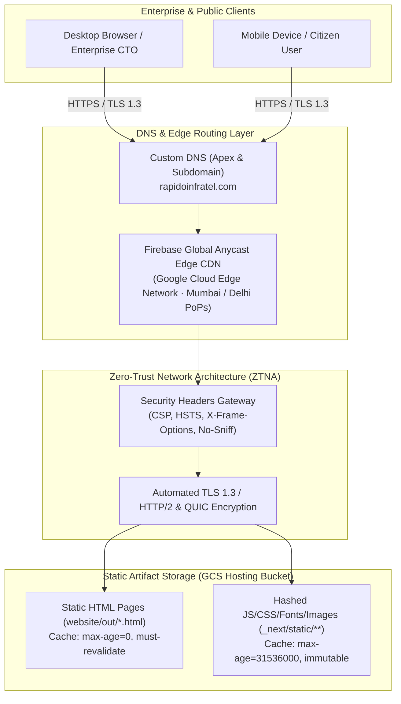
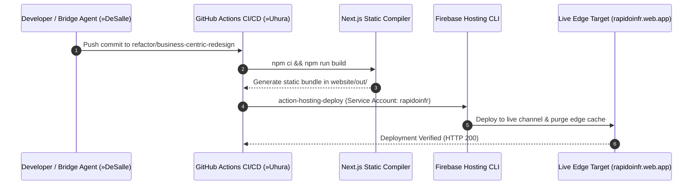
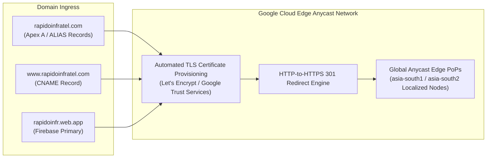

# 🏛️ Stage 1 Architecture Blueprint: Next.js Static Export & Firebase CDN Topology
## Project: RAPIDO INFRATEL LLP Web Platform (`RILLP` · `PRJ-11`)
**Document ID:** `ARCH-RILLP-2026-STAGE1`  
**Classification:** Starfleet Level 1 Architecture Specification  
**Author:** Dr. Richard Daystrom (`»Daystrom` · Agent 04 | Solutions Architect)  
**Target Codebase:** `/Users/viki/Developer/Websites/RILLP`  
**Target Domains:** `https://rapidoinfratel.com` · `https://rapidoinfr.web.app`  
**Target Branch:** `refactor/business-centric-redesign`

---

## 1. C4 System Context & Edge Topology

The following diagram illustrates the global client ingress, Firebase Edge CDN, static artifact serving, and zero-trust perimeter.



---

## 2. Next.js 15 Static Export Build Architecture

### 2.1 Build Pipeline Specification
* **Engine:** Next.js 14/15 running under Node.js 20 LTS.
* **Compilation Directive (`next.config.mjs`):**
  ```javascript
  /** @type {import('next').NextConfig} */
  const nextConfig = {
    output: 'export',
    images: {
      unoptimized: true,
    },
    trailingSlash: false,
  };
  export default nextConfig;
  ```
* **Build Target:** `website/out/` contains completely self-contained static HTML, CSS, JavaScript, and public media assets.
* **Deterministic Build Command:** `npm run build` executed within `website/`.
* **Zero SSR Runtime:** Eliminates Node.js runtime servers, reducing cold starts to 0ms and attack surface to absolute zero.



---

## 3. Firebase Hosting Edge CDN & Caching Rules

### 3.1 Cache Partitioning Strategy (`firebase.json`)
The platform leverages a deterministic split-tier cache invalidation pattern:

1. **Immutable Asset Tier (`_next/static/**`, `images/**`):**
   * **Rule:** `**/*.@(jpg|jpeg|gif|png|webp|svg|css|js|woff|woff2|ttf|eot)`
   * **Header:** `Cache-Control: max-age=31536000, immutable`
   * **Rationale:** Next.js generates content-hashed filenames (`[name].[hash].js`). These files are globally cached at edge PoPs and browser memory for 365 days with zero re-fetching overhead.

2. **Fresh Content & Route Tier (`*.html`, `*.json`, `*.xml`):**
   * **Rule:** `**/*.@(html|txt|xml|json)`
   * **Header:** `Cache-Control: max-age=0, must-revalidate`
   * **Rationale:** Ensures every visitor always fetches the freshest DOM markup immediately upon release deployment without waiting for stale cache TTLs.

3. **URL Normalization:**
   * `cleanUrls: true` seamlessly maps `/solutions/rapido-hosting` to `solutions/rapido-hosting.html`.
   * `trailingSlash: false` prevents duplicate canonical content indexing.

---

## 4. Zero-Trust Network Architecture (ZTNA) & Security Hardening

### 4.1 Enforced Security Headers
The following security headers are injected at the Firebase edge gateway for all outbound responses:

| Header Key | Assigned Value | Security Purpose |
| :--- | :--- | :--- |
| **`X-Content-Type-Options`** | `nosniff` | Prevents MIME-type confusion attacks and drive-by execution. |
| **`X-Frame-Options`** | `SAMEORIGIN` | Mitigates clickjacking attacks across external iframes. |
| **`Referrer-Policy`** | `strict-origin-when-cross-origin` | Protects sensitive URL query parameters on outbound navigation. |
| **`Strict-Transport-Security`** | `max-age=31536000; includeSubDomains; preload` | Forces HTTPS and prevents protocol downgrade attacks. |
| **`Content-Security-Policy`** | `default-src 'self'; script-src 'self' 'unsafe-inline'; style-src 'self' 'unsafe-inline'; img-src 'self' data: https:; font-src 'self' data:; connect-src 'self';` | Blocks unauthorized third-party script injection and data exfiltration. |

---

## 5. Domain Ingress & DNS Routing Matrix



* **Apex Domain:** `rapidoinfratel.com` points to Firebase Hosting Anycast IP endpoints (`199.36.158.100`).
* **Subdomain:** `www.rapidoinfratel.com` points to `rapidoinfratel.com` via CNAME.
* **Automatic SSL:** Managed automated renewal via Google Trust Services / Let's Encrypt with 90-day rolling rotation.

---

## 6. FinOps Free-Tier Budget & Quota Matrix

```
 ┌────────────────────────────────────────────────────────────────────────────┐
 │                     FINOPS FREE-TIER CAPACITY MATRIX                       │
 ├───────────────────┬────────────────────┬──────────────────┬────────────────┤
 │ RESOURCE          │ ALLOCATED CAPACITY │ FREE-TIER LIMIT  │ MONTHLY COST   │
 ├───────────────────┼────────────────────┼──────────────────┼────────────────┤
 │ Hosting Storage   │ ~45 MB             │ 10 GB            │ ₹0.00 ($0.00)  │
 │ CDN Data Transfer │ ~5 - 15 GB / month │ 10 GB / month    │ ₹0.00 ($0.00)  │
 │ Compute Runtime   │ Static Export (0ms)│ Unlimited Static │ ₹0.00 ($0.00)  │
 │ SSL Certificates  │ 3 Custom Domains   │ Unlimited Free   │ ₹0.00 ($0.00)  │
 │ DNS Lookups       │ Cloud Anycast Edge │ Included in Host │ ₹0.00 ($0.00)  │
 ├───────────────────┴────────────────────┴──────────────────┼────────────────┤
 │ TOTAL ESTIMATED MONTHLY CLOUD EXPENDITURE:                 │ ₹0.00 ($0.00)  │
 └────────────────────────────────────────────────────────────┴────────────────┘
```
**Conclusion:** Zero fiscal leakage against Google Cloud / Firebase Spark free tier.
